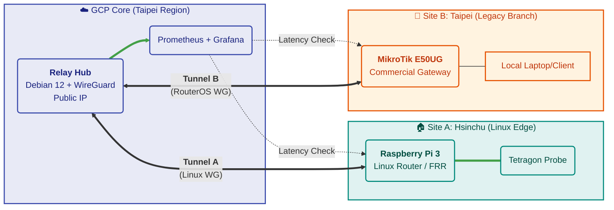

# EdgeLink: Hybrid Cloud Network Observability & Traffic Governance Lab
A hybrid cloud network architecture that bypasses hostile NAT environments to enable observability for edge devices.

(Last update: 12/22)

## Overview

I built EdgeLink because I needed to monitor network devices (like a MikroTik router and Raspberry Pi) located in a building with "Triple NAT"—meaning no public IP and no way to accept incoming connections. Standard VPNs failed because they require at least one side to have an open port.

This project solves that by using a Google Cloud (GCP) VM as a "Relay Hub." Both edge sites initiate the connection outbound to the cloud hub. Once connected, they form a unified private network (Overlay) where I can run monitoring tools like Prometheus and Grafana to track latency and packet loss in real-time.

It’s essentially a DIY SD-WAN that trades expensive proprietary hardware for Linux networking knowledge.

## Architecture



## How It Works
The architecture relies on a Hub-and-Spoke topology where the "Hub" is a static point in the cloud, and "Spokes" are the dynamic edge sites.

- Reverse Connection: Since the Edge cannot receive traffic, it must start the tunnel. I use WireGuard with PersistentKeepalive = 25s to keep the NAT state tables open.

- The Relay: The GCP instance runs Debian with IP Forwarding enabled. It acts as a router, passing traffic between the Pi (Site A) and the MikroTik (Site B).

- Observability: A Prometheus instance on the Hub scrapes metrics from the edge nodes through these tunnels, allowing me to see "inside" the NATed network.

## Getting Started (User Guide)
This guide assumes you want to replicate this setup for your own home lab or edge monitoring.

Prerequisites:
- A Google Cloud Platform account (Free Tier e2-micro is sufficient).

- A Raspberry Pi (or any Linux machine) for the edge.

- (Optional) A MikroTik router for the second edge site.


1. Cloud Hub Setup
Spin up a Debian/Ubuntu VM on GCP. Open UDP port 51820 in the VPC Firewall.

```bash
# Enable IP Forwarding to allow routing
echo "net.ipv4.ip_forward=1" | sudo tee -a /etc/sysctl.conf
sudo sysctl -p

# Install WireGuard
sudo apt update && sudo apt install wireguard
```

2. Edge Node Setup (Linux)
On your Raspberry Pi, install WireGuard and configure the interface to "dial out" to the Hub.

```bash
# /etc/wireguard/wg0.conf
[Interface]
PrivateKey = <Your_Pi_Private_Key>
Address = 10.10.10.2/24

[Peer]
PublicKey = <Your_Hub_Public_Key>
Endpoint = <GCP_Static_IP>:51820
AllowedIPs = 10.10.10.0/24
PersistentKeepalive = 25  # <--- CRITICAL for NAT Traversal
```

3. Verify Connectivity
From the Pi, try to ping the Hub's internal IP.


## Known Issues / Roadmap
Things that are currently broken or incomplete:

Automated Failover: Currently, if the GCP Hub goes down, the entire overlay network stops. There is no redundant hub yet.

Ansible Migration: The migration from Bash scripts to Ansible is only 50% complete. The MikroTik configuration is still manual.

Security: The current setup allows full traffic between spokes. I plan to implement stricter iptables rules on the Hub to isolate sites.

Contact
Sky Sung - [LinkedIn](https://www.linkedin.com/in/tian-yu-sung-sky/)
