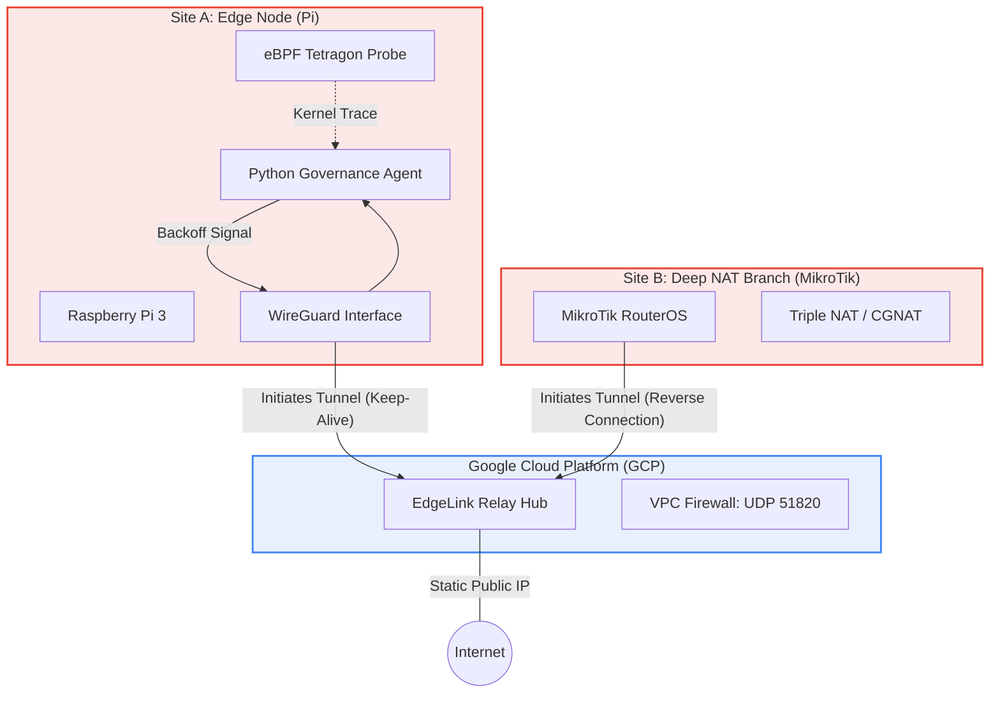

# EdgeLink: Hybrid Cloud Network Observability & Traffic Governance Lab
(Last update: 12/22)

## Overview
EdgeLink is a research project designed to simulate and solve enterprise edge connectivity challenges in hostile network environments.

It focuses on two main engineering goals:
1.  **Hybrid Cloud Connectivity**: Overcoming "Triple NAT" and CGNAT barriers using a **Hub-and-Spoke WireGuard architecture** anchored on Google Cloud Platform (GCP).
2.  **Kernel-Level Observability**: Leveraging **eBPF (Tetragon)** to trace network events at the kernel level, attributing latency spikes to specific processes beyond standard SNMP metrics.

## Architecture: The "Hub-and-Spoke" Pivot
Due to the lack of Public IPs at both the HQ and Branch sites (Triple NAT environment), the architecture utilizes a GCP VM as a static relay hub.


Key Features
1. Resilient Hybrid Networking (Hub-and-Spoke)
Infrastructure: Hosted on GCP Compute Engine (e2-micro) running Debian 12.

NAT Traversal: Solved the "Triple NAT" and "Double CGNAT" issue where neither site had a public IP.

Mechanism: Implements a Reverse Connection strategy where edge nodes initiate the handshake to the Cloud Hub with PersistentKeepalive=25 to maintain state table entries.

2. Smart Traffic Governance
Automated Backoff: A custom Python telemetry agent monitors WireGuard throughput in real-time.

Logic: Differentiates between LAN saturation and WAN contention. Automatically throttles background tasks (e.g., speed tests) when critical traffic flow is detected.

Production Ready: Deployed as a Systemd Service (edgelink-monitor) with auto-healing and journald integration, ensuring 24/7 uptime.

3. Kernel-Level Observability (eBPF)
Tooling: Cilium Tetragon.

Goal: Bypasses standard iptables logging to trace tcp_connect and kfree_skb syscalls directly.

Use Case: Identifies exactly which process (PID) is causing network micro-bursts or dropping packets.

Technology Stack
Cloud & Infra: Google Cloud Platform (GCP), VPC, Compute Engine.

Networking: WireGuard (Kernel Space), MikroTik RouterOS v7.

OS & Systems: Debian 12 (Cloud), Raspberry Pi OS (Edge), Linux Systemd.

Observability: eBPF (Tetragon), Python, tcpdump/Wireshark.

Quick Start
1. Hub Provisioning (GCP)
Currently managed via gcloud CLI (Migration to Terraform planned)

```Bash
# Verify WireGuard Status on Hub
sudo wg show wg0
```
2. Edge Node Deployment (Raspberry Pi)
The monitoring agent is managed via Systemd for production stability.

```bash
# 1. Install Dependencies & WireGuard

sudo ./scripts/setup_mvp.sh

# 2. Enable & Start the Governance Service

sudo systemctl daemon-reload
sudo systemctl enable edgelink-monitor
sudo systemctl start edgelink-monitor

# 3. View Real-time Telemetry Logs

journalctl -u edgelink-monitor -f
```
Roadmap status (v1.3)
[x] Phase 1: Connectivity (Hybrid Cloud)

[x] Pivot to Hub-and-Spoke architecture using GCP.

[x] Establish stable tunnels through Triple NAT.

[x] Phase 2: Observability & Stability

[x] Deploy Systemd daemons for the Python Agent.

[x] Validate eBPF hooks on the Edge Node.

[ ] Phase 3: Automation (In Progress)

[ ] Refactor shell scripts into Ansible Roles (Idempotency).

[ ] Automate MikroTik config backups via Ansible `community.routeros`